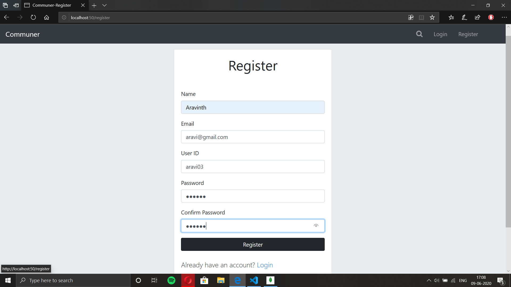
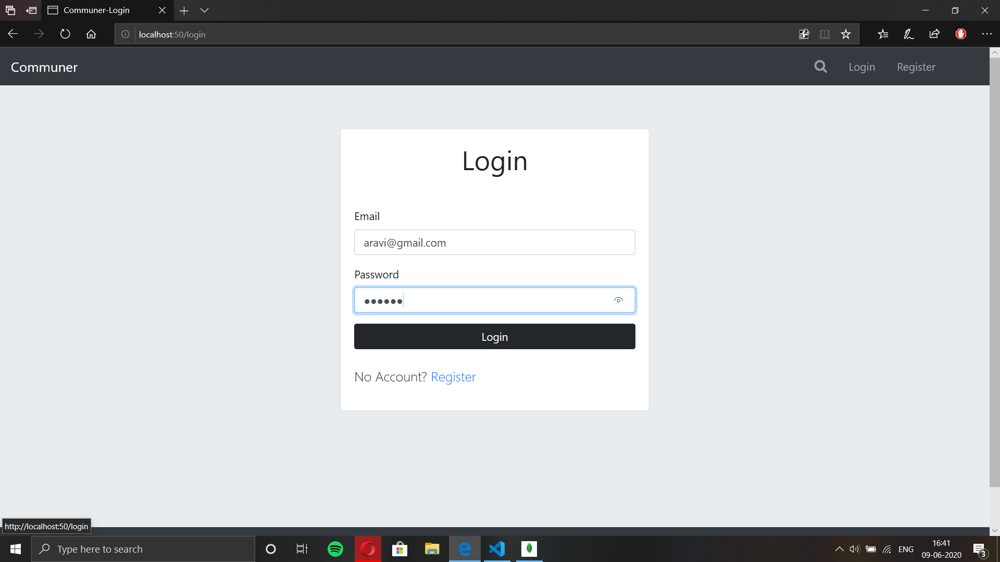
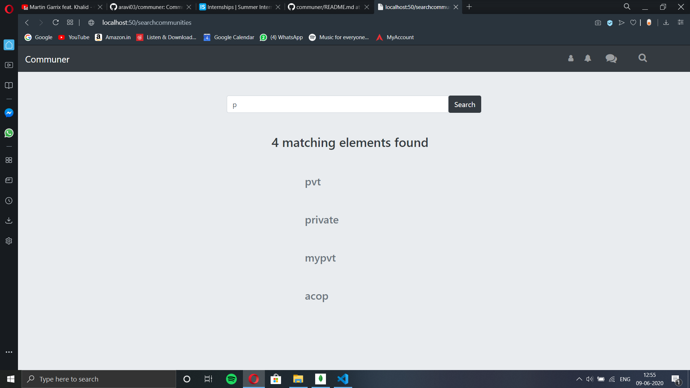
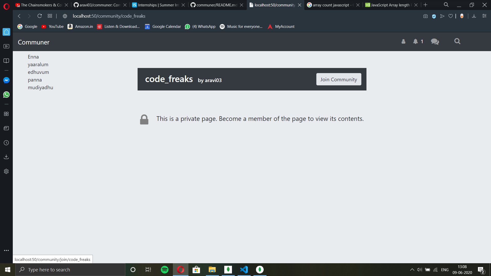
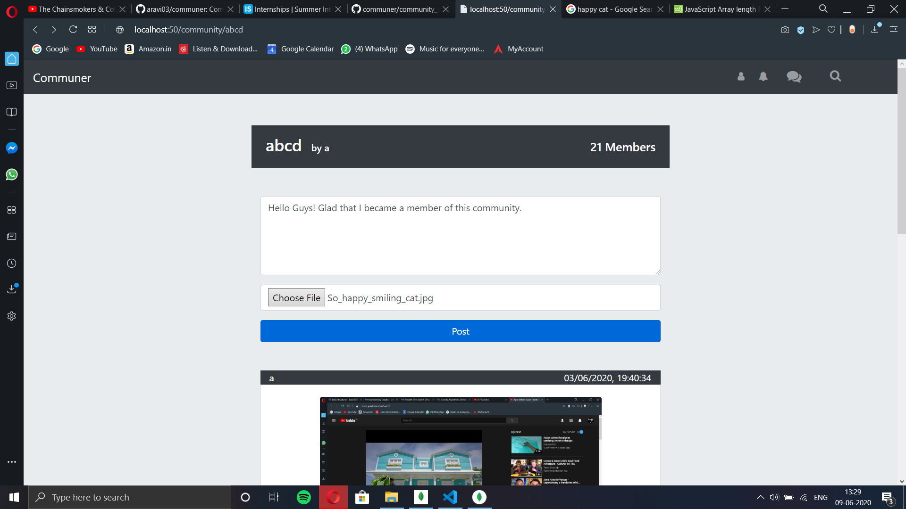

# Communer

 

   

  Communer is a full fledged community based social networking web app. 
  You can become a member of the platform by registering. Once you register you will be able to login to your account. 
 

 
 
 
   You can then create your own communities or can search and become a part of existing communities. 
    
    
   The community's access either public or private. In a public community, the posts in the community will be public whereas in private communities, only the members of the community can view the posts. 
      
   
   Once you become a part of the community, you will be able to add post to the communities which can be text, image or a video. 
     
        
   There is also a newsfeed section where users can see the posts from all their communities.
     

Key Features:
-------------
While the text part of the post is stored in the database, the image and video files are uploaded to the server using a unique name which is then stored to the database and retrived later when the post is to be viewed.
 
Tools used:
-----------
This project uses Node.js and express for backend and MongoDB as the database to store the information.
